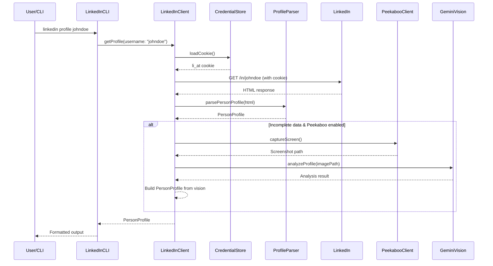
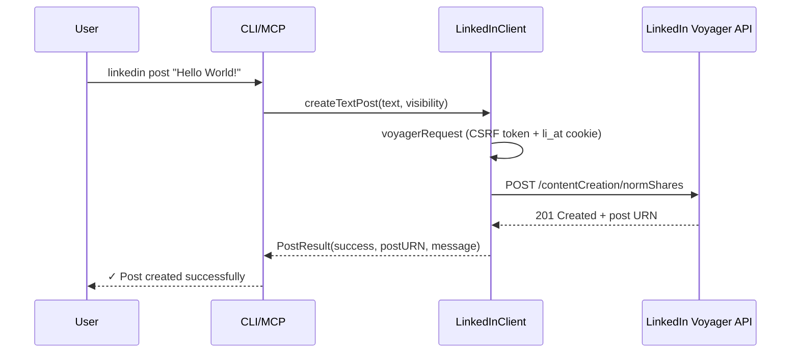
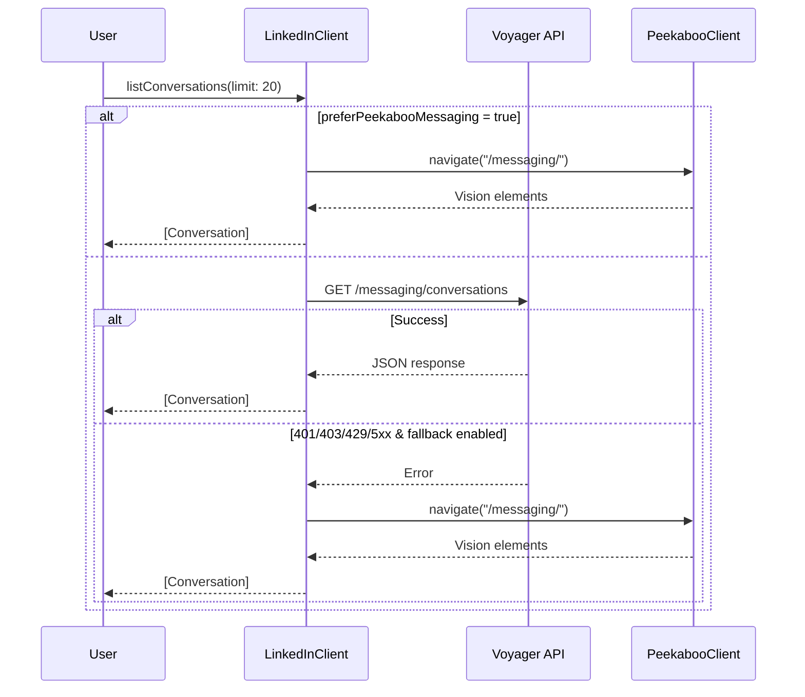
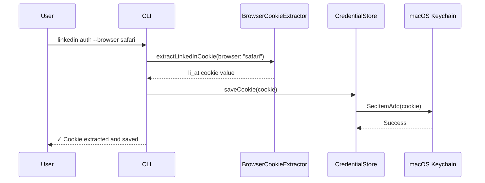

# 🏗️ LinkedFish Architecture

This document describes the system architecture of LinkedFish (package name: LinkedInKit).

## Overview

```
┌─────────────────────────────────────────────────────────────────────────┐
│                        LinkedFish System                                │
├─────────────────────────────────────────────────────────────────────────┤
│                                                                         │
│  ┌────────────────┐    ┌────────────────┐                               │
│  │    CLI Tool     │    │   MCP Server   │   ← User Interface Layer     │
│  │  (LinkedInCLI)  │    │ (LinkedInMCP)  │                               │
│  │  binary:linkedin│    │ binary:        │                               │
│  │                 │    │ linkedin-mcp   │                               │
│  └───────┬─────────┘    └───────┬────────┘                               │
│          │                      │                                        │
│          └──────────┬───────────┘                                        │
│                     │                                                    │
│          ┌──────────▼──────────┐                                         │
│          │    LinkLion Core    │            ← Core Library Layer          │
│          │    (LinkedInKit)    │                                          │
│          └──────────┬──────────┘                                         │
│                     │                                                    │
│    ┌────────────────┼─────────────────────────────┐                      │
│    │                │                             │                      │
│    │    ┌───────────▼──────────┐                  │                      │
│    │    │   LinkedInClient     │  (actor)         │                      │
│    │    │   • verifyAuth()     │                  │                      │
│    │    │   • getProfile()     │                  │                      │
│    │    │   • getCompany()     │                  │                      │
│    │    │   • searchJobs()     │                  │                      │
│    │    │   • getJob()         │                  │                      │
│    │    │   • createTextPost() │                  │                      │
│    │    │   • createArticle…() │                  │                      │
│    │    │   • createImagePost()│                  │                      │
│    │    │   • uploadImage()    │                  │                      │
│    │    │   • listConversations│                  │                      │
│    │    │   • getMessages()    │                  │                      │
│    │    │   • sendInvite()     │                  │                      │
│    │    │   • sendMessage()    │                  │                      │
│    │    └───┬──────────────┬───┘                  │                      │
│    │        │              │                      │                      │
│    │   ┌────▼────┐   ┌────▼────┐                  │                      │
│    │   │Peekaboo │   │ Gemini  │  ← Fallbacks     │                      │
│    │   │ Client  │   │ Vision  │                  │                      │
│    │   └────┬────┘   └────┬────┘                  │                      │
│    │        │              │                      │                      │
│    │   ┌────▼──────────────▼───┐                  │                      │
│    │   │  Browser Automation   │                  │                      │
│    │   │  (Screenshot → AI)    │                  │                      │
│    │   └───────────────────────┘                  │                      │
│    │                                              │                      │
│    │    ┌──────────────┐   ┌──────────────┐       │                      │
│    │    │ProfileParser │   │  JobParser   │       │                      │
│    │    │(SwiftSoup)   │   │(SwiftSoup)   │       │                      │
│    │    └──────────────┘   └──────────────┘       │                      │
│    │                                              │                      │
│    │    ┌──────────────┐   ┌──────────────────┐   │                      │
│    │    │Credential    │   │BrowserCookie     │   │                      │
│    │    │  Store       │   │  Extractor       │   │                      │
│    │    │(Keychain)    │   │(SweetCookieKit)  │   │                      │
│    │    └──────────────┘   └──────────────────┘   │                      │
│    │                                              │                      │
│    └──────────────────────────────────────────────┘                      │
│                     │                                                    │
└─────────────────────┼────────────────────────────────────────────────────┘
                      │
         ┌────────────▼────────────┐
         │    External Services    │
         │  • LinkedIn.com         │
         │    (Voyager API + HTML) │
         │  • macOS Keychain       │
         │  • Peekaboo (browser)   │
         │  • Gemini Vision API    │
         └─────────────────────────┘
```

## Three-Layer Architecture

### Layer 1: User Interfaces

#### CLI Tool (`LinkedInCLI` → binary: `linkedin`)

Command-line interface built with **swift-argument-parser**.

**Entry Point:** `Sources/LinkedInCLI/LinkedIn.swift`

**Commands (11 total):**

| Command | Description |
|---------|-------------|
| `auth` | Configure/extract li_at cookie (manual, browser extraction, interactive) |
| `status` | Check authentication status |
| `profile` | Get person profile by username/URL |
| `company` | Get company profile by name/URL |
| `jobs` | Search for jobs |
| `job` | Get job details by ID/URL |
| `post` | Create a post (text, article/URL, image) |
| `connect` | Send connection invitation |
| `send` | Send direct message |
| `inbox` | List inbox conversations |
| `messages` | Read messages from a conversation |

**Global Options:** `--json` (JSON output), `--cookie` (override cookie)

#### MCP Server (`LinkedInMCP` → binary: `linkedin-mcp`)

Model Context Protocol server for AI assistant integration.

**Entry Point:** `Sources/LinkedInMCP/LinkedInMCP.swift`

**Tools (12 total):**

| Tool | Description |
|------|-------------|
| `linkedin_status` | Auth verification |
| `linkedin_configure` | Set li_at cookie |
| `linkedin_get_profile` | Fetch person profile |
| `linkedin_get_company` | Fetch company profile |
| `linkedin_search_jobs` | Job search |
| `linkedin_get_job` | Job details |
| `linkedin_create_post` | Create a post |
| `linkedin_upload_image` | Upload image to LinkedIn |
| `linkedin_list_conversations` | List inbox conversations |
| `linkedin_get_messages` | Read conversation messages |
| `linkedin_send_invite` | Send connection request |
| `linkedin_send_message` | Send direct message |

**Handler Pattern:** `LinkedInToolHandler` (actor) manages tool routing with `listTools()` and `callTool()` methods.

### Layer 2: Core Library (`LinkLion`)

The main library providing all LinkedIn operations.

**Key Files:**

| File | Description |
|------|-------------|
| `LinkedInClient.swift` | Main API client (actor). Authentication, scraping, posting, messaging |
| `Models.swift` | All data models: `PersonProfile`, `CompanyProfile`, `JobListing`, `JobDetails`, `PostResult`, `Conversation`, `InboxMessage`, etc. |
| `ProfileParser.swift` | HTML parsing for person/company profiles (SwiftSoup) |
| `JobParser.swift` | HTML parsing for job search results and details (SwiftSoup) |
| `CredentialStore.swift` | macOS Keychain integration for secure cookie storage |
| `PeekabooClient.swift` | Browser automation fallback via Peekaboo |
| `GeminiVision.swift` | Vision API integration for screenshot analysis |
| `LinkedInKit.swift` | Version constant, convenience factory, URL extraction helpers |

### Layer 3: External Services

| Service | Usage |
|---------|-------|
| **LinkedIn.com** | Voyager API + HTML scraping |
| **macOS Keychain** | Secure credential storage |
| **Peekaboo** | Browser automation for fallback scraping & messaging |
| **Gemini Vision** | Screenshot → structured data extraction |

---

## Data Flow

### Profile Fetch Flow



### Post Creation Flow



### Messaging Flow (with fallback)



### Authentication Flow



---

## Data Models

```
PersonProfile
├── username: String
├── name: String
├── headline: String?
├── about: String?
├── location: String?
├── company: String?
├── jobTitle: String?
├── experiences: [Experience]
│   ├── title, company, companyURL
│   ├── location, startDate, endDate
│   └── duration, description
├── educations: [Education]
│   ├── institution, degree
│   ├── fieldOfStudy
│   └── startDate, endDate, description
├── skills: [String]
├── profileImageURL: String?
├── backgroundImageURL: String?
├── connectionCount: String?
├── followerCount: String?
└── openToWork: Bool

CompanyProfile
├── name: String
├── slug: String
├── tagline: String?
├── about: String?
├── website: String?
├── industry: String?
├── companySize: String?
├── headquarters: String?
├── founded: String?
├── specialties: [String]
├── employeeCount: String?
├── followerCount: String?
├── logoURL: String?
└── coverImageURL: String?

JobListing
├── id, title, company
├── companyURL, location
├── postedDate, salary
├── isEasyApply: Bool
└── jobURL: String

JobDetails
├── (all JobListing fields)
├── workplaceType: String?   (Remote/On-site/Hybrid)
├── employmentType: String?  (Full-time/Part-time/Contract)
├── experienceLevel: String?
├── applicantCount: String?
├── description: String?
└── skills: [String]

PostResult
├── success: Bool
├── postURN: String?
└── message: String

MediaUploadResult
├── mediaURN: String
└── uploadURL: String

Conversation
├── id: String
├── participantNames: [String]
├── lastMessage: String?
├── lastMessageAt: String?
└── unread: Bool

InboxMessage
├── id: String
├── senderName: String
├── text: String
└── timestamp: String?
```

---

## Dependencies

```
LinkedInKit (Package)
│
├── LinkLion (core library)
│   ├── swift-log (1.6.0+) — Logging
│   └── SwiftSoup (2.7.0+) — HTML parsing
│
├── LinkedInCLI (CLI binary: "linkedin")
│   ├── LinkLion
│   ├── swift-argument-parser (1.5.0+) — CLI framework
│   └── SweetCookieKit (0.3.0+) — Browser cookie extraction
│
├── LinkedInMCP (MCP binary: "linkedin-mcp")
│   ├── LinkLion
│   ├── modelcontextprotocol/swift-sdk (0.9.0+) — MCP server
│   └── swift-log (1.6.0+) — Logging
│
└── LinkedInKitTests
    ├── LinkLion
    └── LinkedInCLI
```

## Platform Requirements

- **macOS:** 14.0+ (Sonoma+)
- **Swift:** 6.0+ (strict concurrency)
- **Xcode:** 16.0+ (for development)

## Security

- All credentials stored in macOS Keychain (service: "LinkLion", account: "li_at")
- No credential logging or persistence in files
- Cookie `li_at=` prefix normalization handled automatically
- CSRF tokens generated per-request for Voyager API calls
- Realistic User-Agent headers to avoid bot detection
- Peekaboo + GeminiVision fallback for anti-bot resilience

## Anti-Bot Strategy

1. **Realistic User-Agent**: Mimics Chrome 120 on macOS
2. **Rate Limiting**: Built-in delays between requests
3. **Browser Fallback**: PeekabooClient uses real browser for hard cases
4. **Vision Parsing**: GeminiVision extracts data from screenshots when HTML fails
5. **Dual Messaging**: `preferPeekabooMessaging` flag for browser-based messaging vs Voyager API
6. **Cookie Extraction**: BrowserCookieExtractor (via SweetCookieKit) pulls cookies from Safari/Chrome/Edge/Firefox
