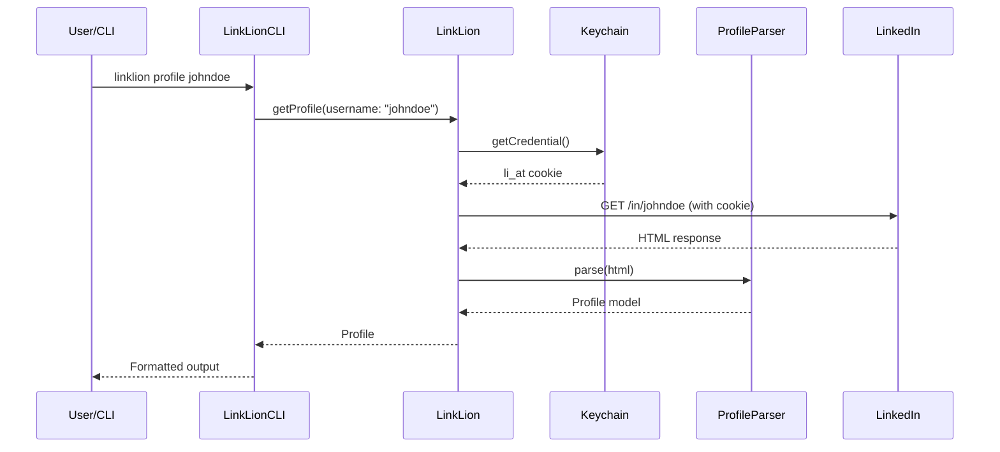
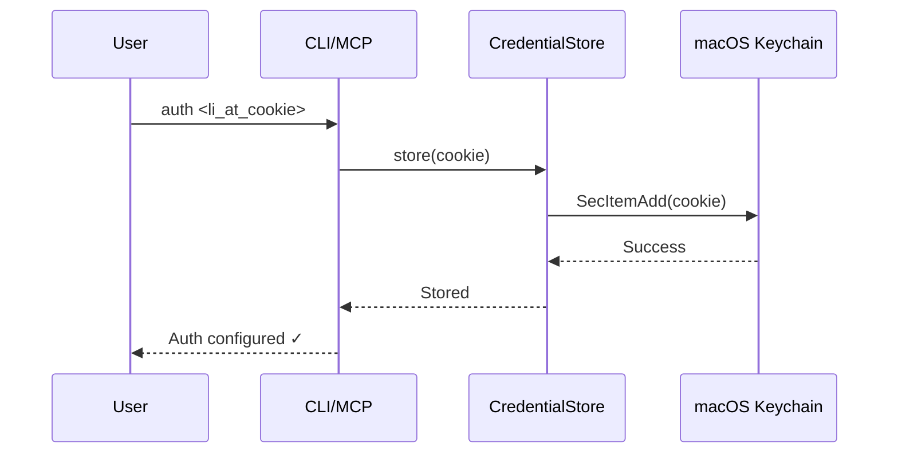

# 🦁 LinkLion Architecture

This document describes the system architecture of LinkLion.

## Overview

```
┌─────────────────────────────────────────────────────────────────┐
│                        LinkLion System                          │
├─────────────────────────────────────────────────────────────────┤
│  ┌──────────────┐    ┌──────────────┐    ┌──────────────┐      │
│  │   CLI Tool   │    │ MCP Server   │    │   Library    │      │
│  │  (linklion)  │    │ (linklion-mcp)│   │   (LinkLion)  │      │
│  └──────┬───────┘    └──────┬───────┘    └──────┬───────┘      │
│         │                   │                   │               │
│         └───────────────────┼───────────────────┘               │
│                           │                                   │
│                    ┌──────▼──────┐                            │
│                    │   Core      │                            │
│                    │  Services   │                            │
│                    └──────┬──────┘                            │
│                           │                                   │
│         ┌─────────────────┼─────────────────┐                 │
│         │                 │                 │                 │
│    ┌────▼────┐      ┌────▼────┐      ┌────▼────┐             │
│    │ Auth    │      │ Client  │      │ Parser  │             │
│    │ Handler │      │         │      │         │             │
│    └────┬────┘      └────┬────┘      └────┬────┘             │
│         │                │                │                   │
│    ┌────▼────┐      ┌────▼────┐           │                   │
│    │Keychain │      │  HTTP   │      ┌────▼────┐             │
│    │ Storage │      │  Client │      │SwiftSoup│             │
│    └─────────┘      └─────────┘      └─────────┘             │
│                           │                                   │
└───────────────────────────┼───────────────────────────────────┘
                            │
                    ┌───────▼───────┐
                    │   LinkedIn    │
                    │     API       │
                    └───────────────┘
```

## Components

### 1. CLI Tool (`LinkLionCLI`)

Command-line interface for direct LinkedIn operations.

**Entry Point:** `Sources/LinkLionCLI/main.swift`

**Commands:**
- `auth` — Configure/set li_at cookie
- `status` — Check authentication status
- `profile` — Fetch person profiles
- `company` — Fetch company profiles
- `jobs` — Search for jobs
- `job` — Get job details

### 2. MCP Server (`LinkLionMCP`)

Model Context Protocol server for Claude Desktop integration.

**Entry Point:** `Sources/LinkLionMCP/main.swift`

**Tools Provided:**
- `linklion_status` — Auth verification
- `linklion_configure` — Set li_at cookie
- `linklion_get_profile` — Fetch profiles
- `linklion_get_company` — Fetch company data
- `linklion_search_jobs` — Job search
- `linklion_get_job` — Job details

### 3. Core Library (`LinkLion`)

The main library providing all LinkedIn operations.

**Modules:**
- `LinkedInClient.swift` — HTTP client & request handling
- `ProfileParser.swift` — Profile HTML parsing
- `JobParser.swift` — Job HTML parsing
- `CredentialStore.swift` — Keychain integration
- `Models.swift` — Data models

## Data Flow

### Profile Fetch Flow



### Authentication Flow



## Data Models

```
Profile
├── name: String
├── headline: String?
├── location: String?
├── about: String?
├── experience: [Experience]
├── education: [Education]
├── skills: [Skill]
└── connections: Int?

Company
├── name: String
├── industry: String?
├── size: String?
├── description: String?
├── specialities: [String]
└── website: URL?

Job
├── id: String
├── title: String
├── company: String
├── location: String
├── description: String?
├── requirements: [String]
└── postedDate: Date?
```

## Dependencies

```
LinkLion
├── swift-argument-parser (CLI)
├── swift-sdk (MCP server)
├── swift-log (logging)
└── SwiftSoup (HTML parsing)
```

## Platform Requirements

- **macOS:** 14.0+ (Sonoma+)
- **Swift:** 6.0+
- **Xcode:** 16.0+ (for development)

## Security

- All credentials stored in macOS Keychain
- No credential logging or persistence in files
- Secure credential retrieval per request
